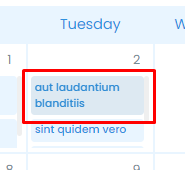
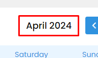

# vue-calendar@1.1.4

updated 14.04.2024

## Project setup

```bash
yarn

yarn dev [--port <port>] # default port is 5173

yarn build # runs typecheck and then builds the project

yarn preview # lauches a server to preview the built project
```

## Usage in other projects

To use the pacakage in a project, you need to add a `.npmrc` file to the projects root directory

```txt
//npm.pkg.github.com/:_authToken=<token> 
@borderss:registry=https://npm.pkg.github.com
```

Go to <https://github.com/settings/tokens> and generate a new personal access token with the `read:packages` permission. Then replace `<token>` with the generated token.

After this, you can add the package to the app with

```bash
yarn add @borderss/vue-calendar
```

In the project, find your `main.ts` or `main.js` file and add the following lines

```javascript
import calendar from "@borderss/vue-calendar"
import "@borderss/vue-calendar/dist/style.css"
```

In the same file, find a chain of `.use()` calls on a `createApp()` object and add the following line

```javascript
createApp(App)
  .use(vuetify)
  .use(store)
  .use(router)
  .use(calendar) // add this line
  .mount("#app")
```

Now you can use the calendar component globally across the project without importing it

```html
<template>
  <VueCalendar :options="calendarOptions"/>
</template>
```

## VueCalendar: Options parameter

The `options` parameter is of type `CalendarOptions` and can be used to customize the calendar component visually and functionally.

The comment next to each key is its default value

```typescript
interface CalendarOptions {
  events?: Event[]                            // []
  defaultView?: ViewType                      // 'month'
  showViewSelector?: boolean                  // true
  showNavigation?: boolean                    // true
  mobileBreakpointPx?: number                 // 768
  forceMobile?: boolean                       // false
  forceDesktop?: boolean                      // false
  locale?: string                             // 'en'

  // Custom color overrides
  colors?: {
    containerBg?: string                      // #ffffff
    primaryBg?: string                        // #2f92df
    primaryBgText?: string                    // #ffffff
    secondaryBg?: string                      // #e9f5ff
    textPrimary?: string                      // #000000
    textSecondary?: string                    // #768B95
    dateSelectedColor?: string                // #69b8ff
    dateBackground?: string                   // #ffffff
    dateBackgroundNotThisWeek?: string        // #f9f9f9
    scrollbarColor?: string                   // #efefef
  }

  onEventClick?: (event: Event) => void       // Fired when an event card is clicked
  onViewChange?: (view: ViewType) => void     // Fired when view changes
  onNavigationChange?: (date: Date) => void   // Fired wehn user navigates in the calendar
}

interface Event {
  title: string         // REQUIRED // title of the event
  date: Date | string   // REQUIRED // date of the event
  startTime?: string    // Start time of the event, eg. "12:30"
  endTime?: string      // End time of the event, eg. "14:30"
  allDay?: boolean      // Whether the event is all day or not
  color?: 'blue'        // Color of the event card. If not provided, uses `primaryBg`
        | 'green'
        | 'red'  
        | 'yellow'
  [key: string]: any          // allow extra attributes for custom implementations
}

type ViewType = 'day' | 'week' | 'month'
```

## VueCalendar: Slots

The calendar component provides slots to allow custom implementations of the calendar. The following slots are available

```html
<template>
  <VueCalendar :options="calendarOptions">
    <template #eventCard="{ event }"> 
      <!-- Customn event card -->
    </template>
    <template #dataDisplay="{ date }">
      <!-- Custom data display -->
    </template>
  </VueCalendar>
```

`eventCard`
slot provides event object, with type `Event`.



`dataDisplay`
slot provides date object with the current date being displayed.



## Example implementation

```html
<template>
  <VueCalendar :options="calendarOptions" />
</template>

<script>
export default {
  ...
  data() {
    calendarOptions: {
      events: [
        { 
          id: 1,
          title: "Event 1",
          date: "2021-09-01",
          startTime: "12:30",
          endTime: "14:30",
          color: "blue"
        },
        {
          id: 2,
          title: "Event 2",
          date: "2021-09-02",
          startTime: "12:30",
          endTime: "14:30",
          color: "green"
        },
      ],
      showViewSelector: false,
      onEventClick: (e) => {
        this.$router.push({ path: `/articles/${e.id}` });
      },
    },
  }
}
</script>
```

## Contribution

kr4 vnk paprasit albertam vai mikam
